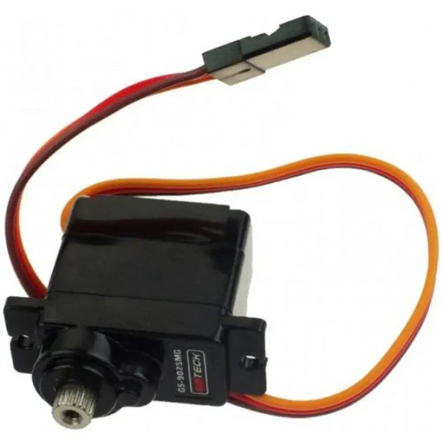

# Orrery - Servo Testing

Many many moons ago, I read something about the [DeMoor Orrery](https://demoor-orrery.com/en) in [Issue 114 of the MagPi (Raspberry Pi Official Magazine these days)](https://magazine.raspberrypi.com/issues/114). An [orrery](https://en.wikipedia.org/wiki/Orrery), for all the other uneducated people like me, is something I would call a "planetary clock", that shows the positions of the planets in our solar system, typically with the sun as center point.

And this particular article somehow burned itself into my brain. While having no greater use at all, it would still be so cool to see at all times when which planet is currently. And after coming back to this thought time and time again, the urge to build it myself finally became strong enough for me to do something about it.

## Hardware

_"Now Kevin"_, I thought, _"if you want to move stuff, you'll need motors. Probably servo motors in case you want to move the planets to specific positions"_. And fortunately I ordered so far unused servo motors from the robot shop like 2 to 3 years ago.

Namely, continuous rotation micro servos and metal gear micro servos




Now while thinking about what hardware to use in order to power these, I realized that I had another piece of hardware that I also ordered ages ago and never used. A [servo 2040 from Pimoroni](https://shop.pimoroni.com/products/servo-2040)


## Software

So having all these components I followed [pimoronis documentation on the servo 2040](https://github.com/pimoroni/pimoroni-pico/tree/main/micropython/modules/servo) in order to see how the servos behave and how I could use them.

I thought of iterating from the max to the min value for both servos in order to see what they would do. The LEDs on the board indicate where on our way from min to max we are.

<iframe width="560" height="315" src="https://www.youtube.com/embed/eAZtbUWYL1s?si=w2MAwK_iDxWN8Hwy" title="YouTube video player" frameborder="0" allow="accelerometer; autoplay; clipboard-write; encrypted-media; gyroscope; picture-in-picture; web-share" referrerpolicy="strict-origin-when-cross-origin" allowfullscreen></iframe>

<iframe width="560" height="315" src="https://www.youtube.com/embed/GMEHKxh9jBU?si=I6cPA_owxQXZGX87" title="YouTube video player" frameborder="0" allow="accelerometer; autoplay; clipboard-write; encrypted-media; gyroscope; picture-in-picture; web-share" referrerpolicy="strict-origin-when-cross-origin" allowfullscreen></iframe>

<details>
<summary>
    Here is the code I used for testing the servos
</summary>

```python
from plasma import WS2812
from servo import Servo, servo2040
import time

led_bar = WS2812(servo2040.NUM_LEDS, 1, 0, servo2040.LED_DATA)
led_bar.start()
led_brightness = 130
number_of_leds = 6

def lights_out():
    led_bar.set_rgb(0, 0, 0, 0)
    led_bar.set_rgb(1, 0, 0, 0)
    led_bar.set_rgb(2, 0, 0, 0)
    led_bar.set_rgb(3, 0, 0, 0)
    led_bar.set_rgb(4, 0, 0, 0)
    led_bar.set_rgb(5, 0, 0, 0)

servo = Servo(servo2040.SERVO_1) # calibration=0 => ANGULAR (default) | calibration=2 => CONTINUOS

min_value = servo.min_value()
max_value = servo.max_value()

# we want to let the strip of leds indicate where we are between min & max, so we need a delta value that helps us with that
led_delta = (abs(min_value) + abs(max_value)) / number_of_leds

current_value = min_value
step = (abs(min_value) + abs(max_value)) / 100

# we will reverse the step when we reach a limit, so we need a current_step to keep track of that
current_step = step

print("---- Initiating test sequence...")
print(f"min value: {min_value}")
print(f"max value: {max_value}")
print(f"led_delta: {led_delta}")
print(f"step: {step}\n")

print("---- Let's gooooooooooo....")
while True:
    normalized_current_value = (current_value + abs(min_value))
    how_often_does_led_delta_fit = int(normalized_current_value / led_delta)

    # delta can fit number_of_leds times when it reaches max_value, thefore upper boundary
    led_to_light = min(how_often_does_led_delta_fit, number_of_leds - 1)

    lights_out()
    led_bar.set_rgb(led_to_light, 0, led_brightness, led_brightness)

    servo.value(current_value)

    current_value += current_step
    if current_value >= max_value:
        current_step = -1 * step
        current_value = max_value
        print("REACHED MAX -> back to min")
        led_bar.set_rgb(led_to_light, led_brightness, 0, led_brightness)
    if current_value <= min_value:
        current_step = step
        current_value = min_value
        print("REACHED MIN -> back to max")
        led_bar.set_rgb(led_to_light, led_brightness, 0, led_brightness)

    time.sleep_ms(100)

```

</details>

## Conclusion

Now after testing the servos and thinking about what I want to do with them, it seems obvious that I will need more of the continuos rotation servos, as I plan to make little balls rotate continuously.

I am still unsure how to best translate the rotation of earth around the sun to the little servo, but that's a problem for future Kevin.

See ya in the next one,

Kevin

---

Source:

- [9g continous micro servo](https://eu.robotshop.com/de/products/9g-dauerrotations-micro-servo)
- [2,5 kg Goteck metal gear micro servo](https://eu.robotshop.com/de/products/25-kg-goteck-metallgetriebe-micro-servo)
- [Servo 2040](https://shop.pimoroni.com/products/servo-2040)
